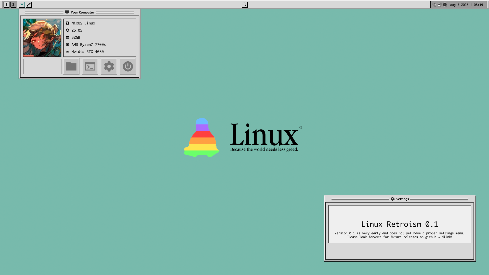
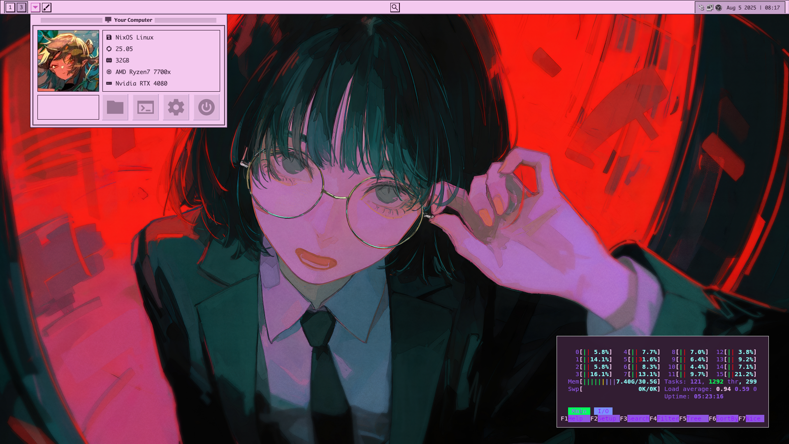
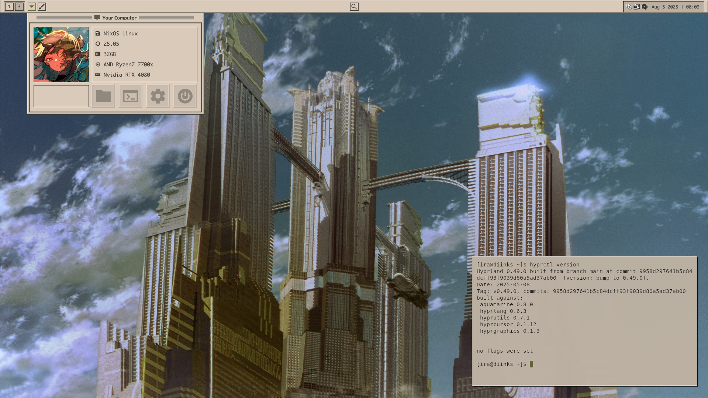

#  Linux Retroism 

▐ **Linux Retroism is a Linux-rice based on the 1980-1990's user-interface aesthetic** ▌

| wallpaper by 96YOTTEA              | wallpaper: Metropolis             |
| ---------------------------------- | --------------------------------- |
|  |  |
|                                    |                                   |

 

### Features (v0.1) 🛈

- Automatic installer (`install.sh` script) with backup support
- Fully quickshell-based front-end (taskbar, app launcher, settings menu, etc)
- Theme support & Built-in theme switcher
- Icon theme & GTK theme

 

### Dependencies ✓

You can use either Hyprland or SwayFX, although I actively use & debug on hyprland. The install script
will let you know if any dependencies are missing.

In general, you must install these or else things may break & not work.

<strong>Window Manager:</strong> 

`Hyprland` or `SwayFX` | `hyprpaper` or `swaybg`

<strong>Applications:</strong> 

`nemo`, `kitty`, `nwg-look`, `quickshell`

<strong>Utilities:</strong> 

`grim`, `slurp`, `swappy`, `hyprshot`, `wl-clipboard`, `mako`, `dconf`, `jq`, `socat`,

 

### Download & Installation 🡇

- After you've installed or cloned the repo, simply run the included `install.sh` script.
- To update, simply get a newer version, and run the `install.sh` script once more.

I recommend getting versions from the `releases` page, but you can also git clone the repo if you
want the latest changes at a higher risk.

The script will take care of everything and will prompt you if you wish to create a backup of all
existing config files that it would replace.

 

### ✦ Notes & TODO Lists

I recommend using Hyprland, as there are some issues sway has with NVIDIA GPUs in my experience.
I will attempt to add fixes to sway if any bugs occur.

Both the Icon theme and GTK theme are very early, I will continue to edit and improve them in
future versions.

**v0.2 TODO List:**

- [ ] Update GTK Theme to be less janky.
- [ ] Higher res icon theme and more icons.
- [ ] Proper settings menu, change font sizes, font, wallpapers, etc.
- [ ] Refactor quickshell code where need be.

### ✦ License

This project is licensed under the permissive MIT license, which is included in the root directory
of this repository.
